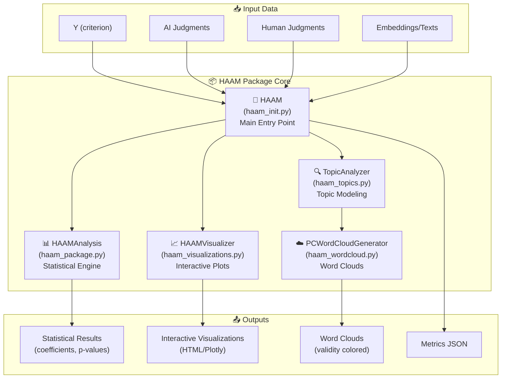

# HAAM Package Architecture Mind Map

## 🏗️ Core Architecture Overview



## 🔗 Component Relationships

### 1. **HAAM Class (Main Orchestrator)**
```
haam/haam_init.py
│
├─→ Initializes with data (Y, AI, HU, embeddings/texts)
├─→ Manages auto_run pipeline
├─→ Coordinates all sub-components
└─→ Provides unified API
```

### 2. **Statistical Analysis Flow**
```
HAAMAnalysis (haam_package.py)
│
├─→ PCA transformation (if embeddings provided)
├─→ Sample-split post-lasso regression
├─→ Debiased coefficient estimation
└─→ Statistical significance testing
```

### 3. **Topic Modeling Pipeline**
```
TopicAnalyzer (haam_topics.py)
│
├─→ UMAP dimensionality reduction
├─→ HDBSCAN clustering
├─→ c-TF-IDF keyword extraction
└─→ PC-topic association analysis
```

### 4. **Visualization Generation**
```
HAAMVisualizer (haam_visualizations.py)
│
├─→ Main HAAM diagram (3x3 grid)
├─→ Coefficient comparison plots
├─→ UMAP scatter plots
├─→ PC arrow plots
└─→ Interactive HTML output
```

### 5. **Word Cloud Creation**
```
PCWordCloudGenerator (haam_wordcloud.py)
│
├─→ High/Low pole word extraction
├─→ Validity coloring logic
├─→ Quartile-based coloring
└─→ PNG/display output
```

## 📁 File Structure & Usage

### ✅ **Core Files (Essential)**
- `haam/__init__.py` - Package exports
- `haam/haam_init.py` - Main HAAM class
- `haam/haam_package.py` - Statistical engine
- `haam/haam_topics.py` - Topic modeling
- `haam/haam_visualizations.py` - Visualizations
- `haam/haam_wordcloud.py` - Word clouds

### 🚀 **Main Usage Scripts**
- `run_haam_analysis.py` - Standard analysis runner
- `run_haam_analysis_v1.3.py` - Latest version with enhancements
- `examples/` - Example notebooks and scripts

### ⚠️ **Potentially Removable (Clutter)**
```
generate_wordclouds_*.py (11 files)
├─ generate_wordclouds_colab.py
├─ generate_wordclouds_final.py
├─ generate_wordclouds_quartile.py
├─ generate_wordclouds_quartile_quartile.py
├─ generate_wordclouds_quartile_quartile_final.py
├─ generate_wordclouds_quartile_quartile_validity.py
├─ generate_wordclouds_quartile_quartile_validity_final.py
├─ generate_wordclouds_validity.py
├─ generate_wordclouds_validity_final.py
├─ generate_wordclouds_validity_final_aligned.py
└─ generate_wordclouds_validity_final_aligned_v2.py ← LATEST/KEEP

test_*.py (6 files) - Development/debug scripts
backup files (*_backup.py)
older versions (v1.2, etc.)
```

## 🔄 Data Flow Diagram

```
Input Data
    ↓
[HAAM Initialization]
    ↓
┌─────────────────────────────────────┐
│  1. HAAMAnalysis                    │
│     • PCA (if needed)               │
│     • Sample-split post-lasso       │
│     • Statistical inference         │
└─────────────────────────────────────┘
    ↓
┌─────────────────────────────────────┐
│  2. TopicAnalyzer                   │
│     • UMAP reduction                │
│     • HDBSCAN clustering            │
│     • Keyword extraction            │
└─────────────────────────────────────┘
    ↓
┌─────────────────────────────────────┐
│  3. HAAMVisualizer                  │
│     • Generate interactive plots    │
│     • Create HTML output            │
└─────────────────────────────────────┘
    ↓
┌─────────────────────────────────────┐
│  4. PCWordCloudGenerator            │
│     • Extract pole words            │
│     • Apply validity coloring       │
└─────────────────────────────────────┘
    ↓
Outputs (Stats, Plots, Word Clouds)
```

## 🎨 Validity Coloring Logic

```
Validity Coloring (in word clouds):
│
├─ Consensus High (dark red): Y=H, HU=H, AI=H
├─ Any High (light red): At least one = H
├─ Consensus Low (dark blue): Y=L, HU=L, AI=L
├─ Any Low (light blue): At least one = L
├─ Opposing (gray): Mix of H and L
└─ All Middle (light gray): All in middle quartile
```

## 🔧 Specialized Variants

### HAAMwithBWS (haam_bws.py)
- For pre-computed interpretable features
- Bypasses PCA transformation
- Maintains statistical rigor
- Use case: Best-Worst Scaling features

## 📊 Your Main Script Connection

Your script (`generate_wordclouds_validity_final_aligned_v2.py`) uses:
1. **HAAM class** for main analysis
2. **TopicAnalyzer** (via haam.topic_analyzer) for topic data
3. **PCWordCloudGenerator** (via haam.create_pc_wordclouds) for word clouds
4. Custom helper functions for sparse data handling

## 🎯 Recommendations

### Keep These:
- All files in `haam/` directory
- `run_haam_analysis_v1.3.py`
- `generate_wordclouds_validity_final_aligned_v2.py`
- `examples/` directory
- Configuration files (setup.py, pyproject.toml)

### Consider Removing:
- Older wordcloud generation scripts (keep only the latest)
- Test scripts (unless part of formal testing)
- Backup files
- Older version scripts

### Organize Into:
```
haam/
├── haam/           # Core package (clean)
├── scripts/        # Active usage scripts
├── examples/       # Example notebooks
├── tests/          # Formal test suite
└── archive/        # Old/experimental scripts
```